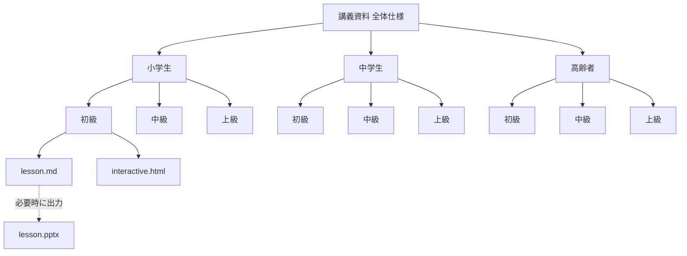

# 講義資料 全体仕様

## 目的

小学生・中学生・高齢者を対象に、パソコン、インターネット、プログラミング、AI、Web、開発の基本を段階的に学べる講義資料を作成する。

この資料は、個別コースを作る前の上位仕様として扱う。各コースの原本である `lesson.md` と、体験教材である `interactive.html` は、この仕様をもとに具体化する。PowerPoint `.pptx` は必要に応じて `lesson.md` から出力する派生物として扱う。

## 対象者

| 対象 | 想定イメージ | 主な配慮 |
|---|---|---|
| 小学生 | プログラミング教室的な授業 | 体験重視、専門用語を減らす、Scratchやゲーム制作を活用 |
| 中学生 | プログラミング塾的な授業 | 構文理解、Webアプリ、Python、JavaScript、開発プロセスへ接続 |
| 高齢者 | パソコン教室的な授業 | PC操作、ファイル管理、安全なインターネット利用、日常活用を重視 |

## レベル設計

| レベル | 到達目標 |
|---|---|
| 初級 | 用語と基本操作を理解し、簡単な体験ができる |
| 中級 | 小さな成果物を自力で作り、仕組みを説明できる |
| 上級 | 企画、設計、実装、テスト、公開、改善の流れを経験する |

## 教材形式

各講義は、原則として Markdown と HTML を主形式として作成する。PowerPoint は原本として管理せず、授業環境や配布要件に応じて必要な場合だけ出力する。

| 形式 | 位置づけ | 用途 |
|---|---|---|
| Markdown `lesson.md` | 原本 | Marp for VS Code 用の編集ソース、授業スライド |
| HTML `interactive.html` | 原本 | クイズ、操作体験、インタラクティブ教材 |
| PowerPoint `.pptx` | 派生物 | 授業投影、印刷、共有が必要な場合のみ出力 |

## 初期スコープ

最初に作る範囲は **小学生向け・初級** とする。

理由:

- 全対象・全レベルを一度に作ると教材量が大きくなり、品質レビューが難しくなる。
- 小学生初級は、パソコン、インターネット、プログラミング、AIの土台を最も平易に整理する必要があり、他コースへ展開しやすい。
- 60〜90分授業の型を先に作ることで、中学生・高齢者向けへ再利用しやすい。

## 1コマの想定

| 項目 | 内容 |
|---|---|
| 時間 | 60〜90分 |
| 分量 | 標準 |
| 構成 | 説明、クイズ、ハンズオン、発表、振り返り |

## 入れたい内容

### コンピューター基礎

- パソコンとは
- OSとは
- フォルダとは
- ファイルとは
- キーボード、マウス、タッチパッドの基本操作
- データ保存、名前付け、整理

### インターネット・Web

- インターネットとは
- Webサイトとは
- ブラウザとは
- サーバーとは
- URL、検索、リンク
- 安全なインターネット利用

### プログラミング

- プログラミングとは
- プログラミング言語とは
- 構文とは
- 順次実行、条件分岐、繰り返し、変数、イベント
- アプリとは
- ゲームとは
- Webアプリとは

### AI

- AIとは
- AIでできること
- AIでできないこと
- AIの間違い、確認の必要性
- AIを使った文章、画像、アイデア出し
- 個人情報や著作権への注意

### 開発

- 開発とは
- 開発フロー
- 企画
- 設計
- 実装
- テスト
- 不具合対応
- リリース
- マネタイズ
- 運用
- 改善

## ハンズオン方針

| 対象 | 主なハンズオン |
|---|---|
| 小学生 | Scratch、HTML/CSS/JavaScriptのごく簡単な体験、PC基本操作 |
| 中学生 | Python、HTML/CSS/JavaScript、Webアプリ、簡単なゲーム |
| 高齢者 | フォルダ・ファイル操作、検索、メール、Web利用、AI活用 |

パソコンの基礎回では、プログラミングに限定せず、フォルダ作成、ファイル保存、名前変更、移動、削除などの基本操作をハンズオンに含める。

## 追加検討したい内容

- 情報モラル、ネットリテラシー
- パスワードとアカウント管理
- 著作権、引用、画像利用
- タイピング練習
- データとは何か
- センサー、IoT、ロボットなど現実世界との接続
- デバッグの考え方
- チーム開発、役割分担
- 発表、説明、振り返り
- 保護者向け・家族向けの補足資料

## 全体構成案

## 設計理由

- データモデル先行で、対象者、レベル、教材形式、講義トピックを分けて定義する。
- UIやスライド表現は後段に回し、まずコース構造と到達目標を固定する。
- 小学生初級を先に作ることで、用語の難易度、授業時間、ハンズオン粒度の基準を作る。
- Markdownをスライド原本、HTMLを体験教材の原本にすることで、差分管理とレビューをしやすくする。
- PowerPointを派生物にすることで、同じ内容を複数形式で手作業管理する負荷を下げる。

## トレードオフ

- PowerPointを派生物にすると、PowerPoint上での細かい手編集は原則として反映対象外になる。
- 対象者とレベルを細かく分けるほど再利用性は上がるが、制作量は増える。
- 小学生向けに比喩を多くすると理解しやすい一方で、中学生以上では説明が幼く見える可能性がある。
- HTML教材は体験価値が高いが、ブラウザ差異や端末差異の確認が必要になる。

## 代替案

最初から全対象・全レベルの一覧表だけを作り、個別教材は後回しにする案もある。

この案は全体像を先に把握しやすい一方で、実際の授業で使える品質まで到達しづらい。今回は、全体仕様を置いたうえで、小学生初級から具体教材を作る方針を採用する。

## セキュリティ・権限境界

- 授業中に使う外部サービスは、アカウント作成要否、年齢制限、保護者同意を確認する。
- APIキー、パスワード、個人情報を教材内に書かない。
- AI利用時は、児童・生徒・受講者の個人情報を入力しない。
- インターネット検索や画像利用では、著作権と不適切コンテンツへの導線に注意する。
- 高齢者向けでは、詐欺サイト、偽警告、フィッシング、サポート詐欺を重点的に扱う。

## 危険ケース

- 端末操作が追いつかず、授業が説明だけで終わる。
- Scratchや外部AIサービスが授業当日に使えない。
- 学習者の年齢差・経験差で、同じ教材が簡単すぎる、または難しすぎる。
- インターネット利用中に不適切な検索結果や広告が表示される。
- 教材内の例が特定サービスに依存し、サービス変更で使えなくなる。
- PowerPointを手編集すると、Markdown原本と内容がずれて講師が混乱する。

## 現在の決定

| 質問 | 決定 |
|---|---|
| 資料の形式 | Markdown、HTMLを原本にする。PowerPointは必要時のみ出力する |
| 最初に作る範囲 | 小学生の初級だけ先に作る |
| 1コマの想定時間 | 60〜90分 |
| ハンズオン | Scratch、Python、HTML/CSS/JavaScript、PC基本操作を対象者に応じて使い分け |
