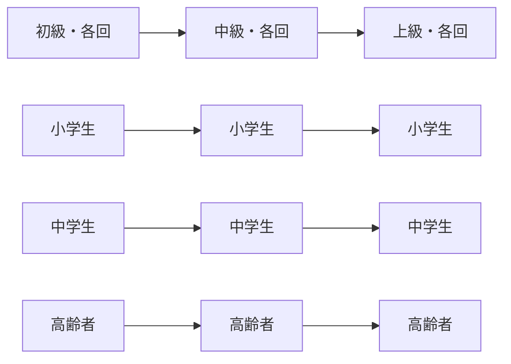

# 講義資料

小学生・中学生・高齢者の **3対象 × 初級／中級／上級** の **全9コース・36回** の授業資料をオープンソースで公開しています。

Marpスライド (`lesson.md`) と インタラクティブHTML (`interactive.html`) の2形式で、講師の説明と受講者の体験を組み合わせて使えます。

---

## 🎉 完成状況

| 対象 | 初級 | 中級 | 上級 |
|---|:---:|:---:|:---:|
| **小学生** | ✅ 4/4 | ✅ 4/4 | ✅ 4/4 |
| **中学生** | ✅ 4/4 | ✅ 4/4 | ✅ 4/4 |
| **高齢者** | ✅ 4/4 | ✅ 4/4 | ✅ 4/4 |

**合計：36回 × (lesson.md + interactive.html) = 72ファイル**

---

## 📚 全コース・全回 一覧

### 小学生向けプログラミング教室

| コース | 第1回 | 第2回 | 第3回 | 第4回 |
|---|---|---|---|---|
| **初級** | パソコンってなんだろう | インターネットとWebサイト | プログラミングってなんだろう | AIってなんだろう |
| **中級** | Scratchでゲーム（前編） | Scratchでゲーム（後編） | HTMLで自己紹介ページ | AIといっしょに作品紹介 |
| **上級** | 作品の企画書をかこう | 作品を作ろう | テストしてなおそう | 発表会 |

### 中学生向けプログラミング塾

| コース | 第1回 | 第2回 | 第3回 | 第4回 |
|---|---|---|---|---|
| **初級** | コンピューターと開発環境 | Webとインターネット | プログラミング基本構文 | AI活用と開発の流れ |
| **中級** | アプリの設計 | フロントエンド実装 | バックエンド入門 (Flask) | テスト・Git・公開 |
| **上級** | 要件定義と設計 | 実装とレビュー | テストとリリース | 運用・改善・マネタイズ概論 |

### 高齢者向けパソコン教室

| コース | 第1回 | 第2回 | 第3回 | 第4回 |
|---|---|---|---|---|
| **初級** | パソコンを使ってみよう | ファイルとフォルダ | インターネットを安全に使う | メール・写真・AIを使ってみる |
| **中級** | 文書を作ろう (Word) | 数字の表を使ってみる (Excel) | 写真・動画とクラウド | ビデオ通話とSNSの基本 |
| **上級** | クラウドとバックアップ | AIを暮らしの相棒に | 情報発信を楽しむ | 行政・金融の電子化 |

---

## 🎨 コース別配色

各コースを 視覚的に 区別できるよう、配色を 差別化しています。

| コース | メイン色 | アクセント | 雰囲気 |
|---|---|---|---|
| 小学生・初級 | `#FF6B6B` コーラル | `#FFE66D` × `#4ECDC4` | ポップ・幼児向け |
| 小学生・中級 | `#FF8C1A` オレンジ | `#FCBD19` × `#4C97FF` | Scratch風 |
| 小学生・上級 | `#7C4DFF` パープル | `#FFD54F` × `#00BFA5` | クリエイティブ |
| 中学生・初級 | `#2563EB` ブルー | `#F59E0B` × `#10B981` | モダン開発者 |
| 中学生・中級 | `#4F46E5` インディゴ | `#F59E0B` × `#10B981` | 技術書風 |
| 中学生・上級 | `#6D28D9` ディープパープル | `#06B6D4` × `#10B981` | プロダクション |
| 高齢者・初級 | `#2E7D32` グリーン | `#FFA000` × `#5D4037` | 落ち着いた木目調 |
| 高齢者・中級 | `#00838F` ティール | `#FFA000` × `#43A047` | 実用・安心 |
| 高齢者・上級 | `#5E35B1` ディープパープル | `#FFA726` × `#26A69A` | 知性・上品 |

---

## ✨ 主要なインタラクティブ機能（抜粋）

各回の `interactive.html` には、ブラウザで動く独自の対話型ツールが組み込まれています。**150以上の機能**を実装。

### 小学生向け

- **🎮 ライブもぐらたたきゲーム**（小・中級第2回）：実際に遊べる完成版＋ Scratchブロック解説
- **📝 ライブHTMLエディタ**（小・中級第3回）：左でコード／右で即時プレビュー、`.html` ダウンロード対応
- **🪪 自己紹介ページメーカー**（小・中級第3回）：35種類の絵文字＋カラーピッカーで本物の HTML を生成
- **📐 マンダラ法アイデア発想**（小・上級第1回）：9マスでアイデアを広げる
- **🎨 画面設計ボード**（小・上級第1回）：パーツをドラッグで自由配置
- **🤖 AI模擬対話**（小・中級第4回／上級第2回）：プロンプト品質に応じて回答が変化

### 中学生向け

- **💾 ライブTODOアプリ**（中・中級第2回）：実際に動作＋ localStorage 永続化＋ DevTools 学習
- **🌐 モック Flask API テスター**（中・中級第3回）：ブラウザ内で完全なREST APIを再現（CRUD＋エラーハンドリング）
- **🗄️ DB スキーマ設計ツール**（中・上級第1回）：CREATE TABLE / TypeScript / JSON を自動生成、ER図にも連動描画
- **🌿 Git ブランチ可視化**（中・上級第2回）：commit/branch/merge をボタン操作で SVG 可視化
- **🛡️ SQLi/XSS プレイグラウンド**（中・上級第2回）：実際の攻撃パターンを試して安全/危険を比較
- **🧪 in-browser Jest ランナー**（中・上級第3回）：`test()` / `expect().toBe()` 実装で本物の感覚

### 高齢者向け

- **📊 印刷可能な町内会案内ジェネレータ**（高・中級第1回）：A4印刷 / .html保存 — 家でも使える
- **💴 家計簿テンプレート**（高・中級第2回）：合計・グラフ自動更新
- **📷 共有範囲シミュレータ**（高・中級第3回）：自分のみ／家族のみ／リンク／公開を視覚化
- **🕵️ 詐欺見破りクイズ**（高・中級第4回）：実物そっくりの SMS / 電話 / LINE / メール
- **🛡️ NG情報チェッカー**（高・上級第2回）：AI に入れていい情報を 正規表現15ルールで判定
- **📒 自分用手順ノート ジェネレータ**（高・上級第4回）：マイナポータル等のログイン手順を印刷可能ノートに

---

## 📸 プレビュー（SVG模式図）

実画面のスクリーンショットは順次追加予定。以下はinteractive.htmlの典型的なレイアウトです。

### コース構成図



### 共通インタラクティブHTML レイアウト

```text
┌─────────────────────────────────────────┬─────┐
│ プログレスバー（上端、スクロール率）           │     │
├─────────────────────────────────────────┤章ナビ│
│                                         │縦並び│
│ Hero（グラデーション背景・大タイトル）       │     │
│                                         │ 1   │
├─────────────────────────────────────────┤ 2   │
│ Section（カード／ツール／クイズ）             │ 3   │
│                                         │ ... │
│  📊 各回独自の対話ツール                       │     │
│  ❓ クイズ（解説付き）                         │     │
│                                         │     │
└──────────────────────────────────────[?]┴─────┘
                                       ↑
                                  キーボード ヘルプ
```

### 共通UXパターン（全36回で統一）

- ⬆️ **プログレスバー**：スクロール率を上端に表示
- 🧭 **章ナビ**（右側）：ホバーで章タイトル表示、クリックで該当章へ
- ❓ **モーダル**：詳細情報をポップアップで（×でクローズ）
- ⌨️ **キーボードショートカット**：`←↑→↓` 章移動、`1-9` で直行、`?` ヘルプ
- 🍞 **トースト通知**：アクション結果を画面下部に一時表示
- ✅ **クイズ**：解説モーダル付き、リトライ無制限

---

## 📂 ディレクトリ構成

```text
.
├── README.md                       # このファイル
├── 00_講義資料_全体仕様.md           # 設計仕様
├── 授業前チェックリスト.md            # 講師向け
├── docs/
│   └── ISSUES.md                  # 改善点・新講座候補のIssue一覧
├── _templates/                    # 新規教材のひな形
│   ├── 00_カリキュラム概要.md
│   ├── lesson.md
│   └── interactive.html
├── scripts/                       # 補助スクリプト
│   ├── README.md
│   └── build-pptx.sh              # Marp → PPTX 一括変換
│
├── 小学生_初級/
│   ├── 00_カリキュラム概要.md
│   ├── 01_パソコンってなんだろう/   { lesson.md, interactive.html }
│   ├── 02_インターネットとWebサイト/
│   ├── 03_プログラミングってなんだろう/
│   ├── 04_AIってなんだろう/
│   └── オプション教材/             # Scratch 入門（任意）
│
├── 小学生_中級/                    # 01〜04 各回
├── 小学生_上級/                    # 01〜04 各回
├── 中学生_初級/                    # 01〜04 各回
├── 中学生_中級/                    # 01〜04 各回
├── 中学生_上級/                    # 01〜04 各回
├── 高齢者_初級/                    # 01〜04 各回
├── 高齢者_中級/                    # 01〜04 各回
└── 高齢者_上級/                    # 01〜04 各回
```

各回フォルダの中身：

```text
NN_タイトル/
├── lesson.md              # Marp 形式のスライド原本
└── interactive.html       # ブラウザで開く対話型教材
```

一部の回には追加で `template.html`（高齢者向けの 手順書 など）が同梱されています。

---

## 🚀 使い方

### スライドを見る

1. VS Code で対象回の `lesson.md` を開く
2. **Marp拡張** でプレビュー
3. 必要に応じて PDF や PPTX へ書き出し

### PPTX を一括書き出し

```bash
./scripts/build-pptx.sh                  # 全対象を変換
./scripts/build-pptx.sh 小学生_初級       # 対象を絞る
./scripts/build-pptx.sh --list           # 対象ファイル一覧の確認のみ
./scripts/build-pptx.sh --pdf            # PPTXに加えPDFも出力
```

出力先は `_generated/<対象者_レベル>/<回フォルダ名>.pptx`。`_generated/` は `.gitignore` 済み。

### 体験教材を使う

`interactive.html` を **ブラウザで直接開く**。ローカルファイルで動作するように設計してあります（外部CDN・APIへの依存なし）。

```bash
# macOS
open 小学生_初級/04_AIってなんだろう/interactive.html

# Linux
xdg-open 小学生_初級/04_AIってなんだろう/interactive.html
```

### 授業で使う（標準フロー）

各回は60〜90分を想定：

1. あいさつ・前回の復習（5分）
2. スライド説明（20分）
3. ハンズオン／インタラクティブ教材（40〜50分）
4. 共有・発表（10分）
5. 振り返り・宿題（5分）

→ 詳細は [`授業前チェックリスト.md`](授業前チェックリスト.md) を参照。

---

## 🎨 設計方針

- **データモデル先行**：対象者 × レベル × 教材形式 × 講義トピックを分けて管理
- **lesson.md = 原本、PPTX = 生成物**：Git管理は原本のみ
- **ブラウザだけで完結**：interactive.html は CDN・API への依存なし（localStorage はOK）
- **配色で識別**：9コース各々で配色を差別化、UI共通パターンは維持
- **AI体験は疑似AI推奨**：実APIに依存せず、プロンプト品質に応じた応答を内蔵
- **段階的開示**：初級は触る・中級は作る・上級は組み立てる

---

## 🔒 セキュリティ・共有時の注意

- **APIキー、パスワード、個人情報を 教材に書かない**
- AI体験で本名、住所、学校名、電話番号、顔写真、友だちの情報を **入力しない**
- 実AIサービスを実演する場合は、年齢制限・アカウント・保護者同意・入力してよい情報を **事前確認**
- 外部AIサービスや Scratch 本体を使う場合は、年齢制限・保護者同意・保存方法を確認
- GitHub で外部共有する場合は、このリポジトリへのアクセス権限を **必要な相手だけに 付与**

---

## 📊 開発統計

- **総スライド数**：約 **1,300+ スライド**（lesson.md 36本）
- **総スクリプト行数**：約 **20,000+ 行**（interactive.html × 36 の JavaScript）
- **対話型ツール数**：**150+** （各回 4〜6個の独自ツール）
- **クイズ問題数**：**100+**
- **印刷可能ドキュメント**：5種（修了証4種＋町内会案内・家計簿・手順ノート）

---

## 🔮 今後の候補

優先度順は [`docs/ISSUES.md`](docs/ISSUES.md) を参照。

- 🎓 **高校生向けコース**（初級／中級／上級）の追加 — 競技プログラミング / 機械学習 / 起業
- 📸 各回の **スクリーンショット** を撮影してREADMEに追加
- 🎥 各回の **デモ動画**（30秒）を作成
- 🌍 **英語版** の作成
- ♿ **アクセシビリティ** 強化（スクリーンリーダー対応、コントラスト確認）
- 🧪 **CI/CD** の追加（HTML構文チェック・リンク切れ検出）

---

## 📝 ライセンス

[（ライセンス未定 — 例：CC BY-SA 4.0 / MIT を検討）]

---

## 📞 著作・連絡先

- 講師：（記入）
- 教室名：（記入）
- 改訂：2026年5月版

新規 Pull Request・改善提案 大歓迎です！
