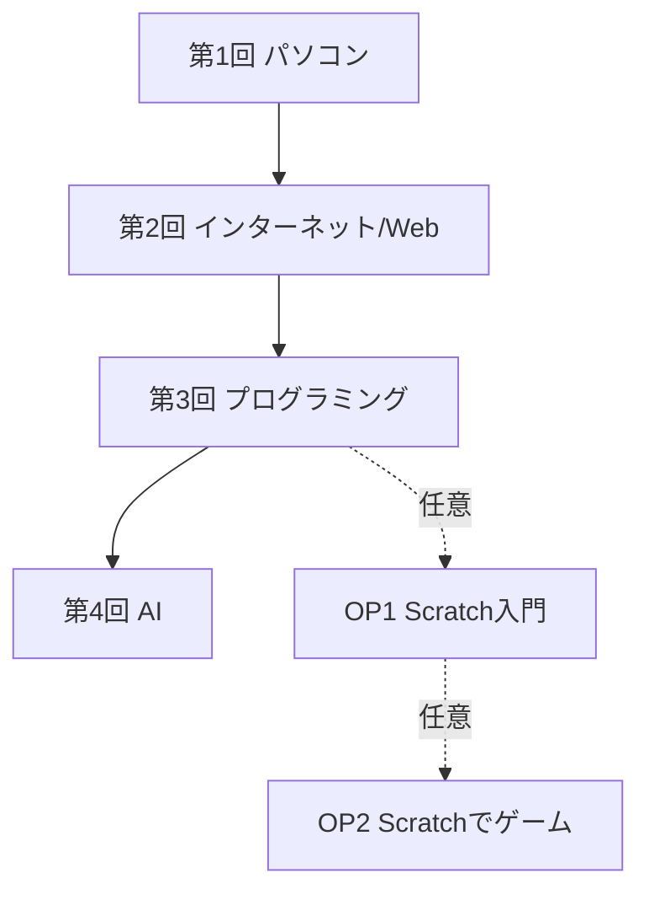

# 講義資料

小学生・中学生・高齢者向けに、パソコン、インターネット、プログラミング、AIを段階的に学ぶための授業資料です。

現在は **小学生向け・初級コース** を先行して整備しています。

## 現在の完成範囲

### 小学生・初級 本編

| 回 | タイトル | 主な内容 | 教材 |
|---|---|---|---|
| 1 | パソコンってなんだろう？ | パソコンの中身、キーボード、マウス、ファイル、フォルダ | `lesson.md` / `interactive.html` |
| 2 | インターネットとWebサイト | インターネット、Webサイト、ブラウザ、サーバー | `lesson.md` / `interactive.html` |
| 3 | プログラミングってなんだろう？ | 命令、順番、くりかえし、もしも、プログラミング言語 | `lesson.md` / `interactive.html` |
| 4 | AIってなんだろう？ | AI、プロンプト、確認、安全な使い方 | `lesson.md` / `interactive.html` |

### オプション教材

Scratchは本編から外し、授業時間や教室環境に応じて使うオプション教材にしています。

| 教材 | タイトル | ファイル |
|---|---|---|
| OP1 | Scratch入門 | `小学生_初級/オプション教材/04_Scratch入門.html` |
| OP2 | Scratchでゲーム | `小学生_初級/オプション教材/05_Scratchでゲーム.html` |



## ディレクトリ構成

```text
.
├── 00_講義資料_全体仕様.md
├── README.md
├── _templates/
│   ├── 00_カリキュラム概要.md
│   ├── lesson.md
│   └── interactive.html
├── 小学生_初級/
│   └── ...
├── 小学生_中級/
│   └── 00_カリキュラム概要.md
├── 小学生_上級/
│   └── 00_カリキュラム概要.md
├── 中学生_初級/
│   └── 00_カリキュラム概要.md
├── 中学生_中級/
│   └── 00_カリキュラム概要.md
├── 中学生_上級/
│   └── 00_カリキュラム概要.md
├── 高齢者_初級/
│   └── 00_カリキュラム概要.md
├── 高齢者_中級/
│   └── 00_カリキュラム概要.md
└── 高齢者_上級/
    └── 00_カリキュラム概要.md
```

小学生初級の詳細:

```text
小学生_初級/
├── 00_カリキュラム概要.md
├── 01_パソコンってなんだろう/
│   ├── lesson.md
│   ├── interactive.html
│   └── lesson.pptx
├── 02_インターネットとWebサイト/
│   ├── lesson.md
│   ├── interactive.html
│   └── lesson.pptx
├── 03_プログラミングってなんだろう/
│   ├── lesson.md
│   ├── interactive.html
│   └── lesson.pptx
├── 04_AIってなんだろう/
│   ├── lesson.md
│   └── interactive.html
└── オプション教材/
    ├── 04_Scratch入門.html
    └── 05_Scratchでゲーム.html
```

## テンプレート

新しい教材を作るときは `_templates/` からコピーして使います。

| テンプレート | 用途 |
|---|---|
| `_templates/00_カリキュラム概要.md` | 新しいコースの概要 |
| `_templates/lesson.md` | Marpスライド原本 |
| `_templates/interactive.html` | 体験教材HTML |

新しい講義回の基本構成:

```text
<対象者>_<レベル>/
└── <NN_タイトル>/
    ├── lesson.md
    └── interactive.html
```

例:

```text
中学生_初級/
└── 01_コンピューターと開発環境/
    ├── lesson.md
    └── interactive.html
```

## 教材形式

| 形式 | 位置づけ | 使い方 |
|---|---|---|
| `lesson.md` | スライド原本 | VS Code + Marp で表示・編集 |
| `interactive.html` | 体験教材原本 | ブラウザで直接開く |
| `lesson.pptx` | 派生物 | 必要な場合のみ投影・印刷・共有に使う |

PowerPointは原本ではありません。内容を更新する場合は、まず `lesson.md` と `interactive.html` を更新してください。

## 使い方

### スライドを見る

1. VS Codeで対象回の `lesson.md` を開く
2. Marp拡張でプレビューする
3. 必要に応じてPDFやPowerPointへ書き出す

### 体験教材を使う

対象回の `interactive.html` をブラウザで開きます。ローカルファイルとして開けるように作っています。

### 授業で使う

各回は60〜90分を想定しています。

標準の流れ:

1. あいさつ・前回の復習
2. スライド説明
3. クイズ・対話
4. ハンズオン
5. 発表・振り返り

## 設計方針

- データモデル先行で、対象者、レベル、教材形式、講義トピックを分けて管理する
- `lesson.md` をスライド原本、`interactive.html` を体験教材原本にする
- PowerPointは必要時に出力する派生物として扱う
- Scratchは小学生初級の必須回ではなく、発展・体験用オプションとして扱う
- AI教材では、実AIサービスへの送信に依存しない安全な体験を優先する

## セキュリティ・共有時の注意

- APIキー、パスワード、個人情報を教材に書かない
- AI体験で本名、住所、学校名、電話番号、顔写真、友だちの情報を入力しない
- 外部AIサービスやScratch本体を使う場合は、年齢制限、アカウント、保護者同意、保存方法を確認する
- GitHubで外部共有する場合は、このリポジトリへのアクセス権限を必要な相手だけに付与する

## 今後の候補

- 各未着手コースの `00_カリキュラム概要.md` を具体化
- 中学生向け初級コースの第1回を作成
- 高齢者向け初級コースの第1回を作成
- 小学生向け中級コースの第1回を作成
- MarpからPowerPointへ出力する手順の整備
- 授業前チェックリストの追加
