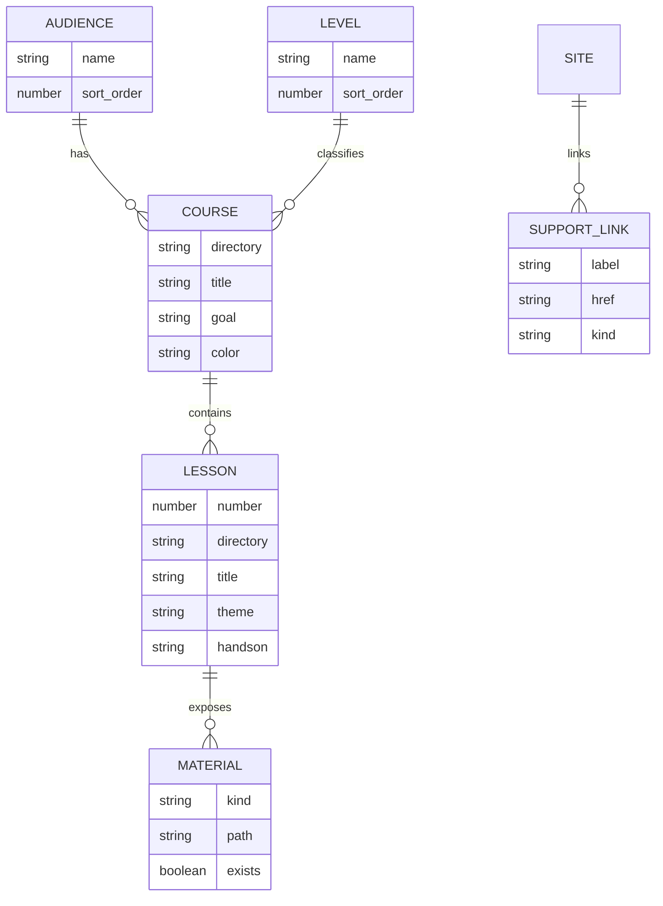
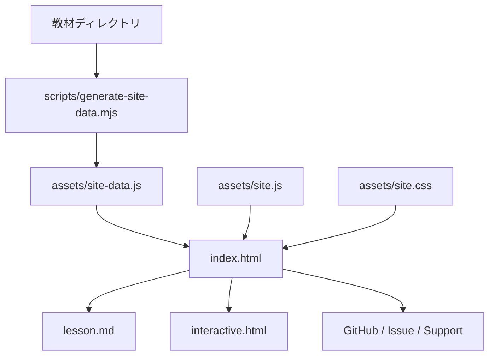

# 静的LP・教材まとめサイト 設計メモ

## 仕様

このサイトは、公開済みの教材リポジトリを読む人のための入口である。ログイン、DB、決済は持たず、教材カタログ、GitHub導線、支援・相談導線だけを提供する。

### 対象読者

| 優先 | 読者 | 主な目的 |
|---:|---|---|
| 1 | 講師・教室運営者・学校ICT担当 | 授業で使える教材を対象別に探す |
| 2 | 保護者・学習者 | 学習範囲と安全性を確認する |
| 3 | OSS貢献者・開発者 | 改善対象を見つけてGitHubへ移動する |

### やること

- LPとして教材セットの価値、対象、規模を伝える
- 4対象 × 3レベル × 4回の教材を一覧化する
- 各回の `lesson.md`、`interactive.html`、スクリーンショットへ移動できる
- GitHubリポジトリ、Issue、支援・相談導線へ移動できる
- 静的HTMLとしてローカルファイルでもGitHub Pagesでも開ける

### やらないこと

- ログイン必須化
- 有料ダウンロード
- ユーザー別の進度管理
- 個人情報の入力・保存
- 未実装の講座ポータルへの強制誘導

## データモデル

## アーキテクチャ

### 境界

| 境界 | 内容 |
|---|---|
| 入力 | リポジトリ内のコースディレクトリ、`00_カリキュラム概要.md`、各回フォルダ |
| 変換 | `scripts/generate-site-data.mjs` が教材構造を静的JSデータへ変換 |
| 表示 | `index.html` と `assets/site.js` がフィルタ可能な教材カタログを描画 |
| 外部副作用 | GitHub、Issue、支援相談先へのリンク遷移のみ |
| トランザクション | なし。静的サイトのため永続化処理を持たない |

## 設計理由

- MIT公開リポジトリでは、ログインや有料DLで教材アクセスを囲い込む実効性が低い。
- 教材の正は既存ディレクトリ構造に置き、LP専用DBを作らないことで更新漏れを減らす。
- `index.html` をルートに置くことで、GitHub Pagesでもローカルファイルでも入口として使いやすい。
- 支援は教材アクセスの条件にせず、任意の貢献・相談導線として扱う。
- 個人情報を集めないため、OWASP Top10上の認証、セッション、保存データに関する攻撃面を増やさない。

## トレードオフ

- 静的サイトなので、ユーザーごとの進度、修了証、ログイン後コンテンツは提供しない。
- 生成済みの `assets/site-data.js` をコミットするため、教材構造変更時は再生成が必要になる。
- GitHub Pages以外のCMS的な編集体験はないが、レビュー可能性と単純さを優先する。
- 支援導線は任意の案内に留めるため、短期的な収益化より信頼とOSS整合性を優先する。

## 代替案

Next.jsなどで講座ポータルを作る案もある。この案は検索、ルーティング、将来の認証追加に強いが、現時点では追加開発なしという方針と逆行し、依存関係、ビルド、ホスティング、脆弱性管理が増える。今回は静的HTMLを採用する。

## セキュリティレビュー

- ユーザー入力は検索語とフィルタのみで、DOMには `textContent` を使って反映する。
- 外部リンクは `target="_blank"` と `rel="noopener noreferrer"` を付ける。
- 支援・相談リンクは教材利用の条件にしない。
- 秘密情報、APIキー、個人情報は扱わない。
- GitHub Pagesで公開する場合も、認証境界や管理画面を持たない。

## 危険ケース

- 教材ディレクトリを追加したのに `assets/site-data.js` を再生成せず、LPに表示されない。
- 支援先が未設定のまま金銭支援を強く訴求し、利用者の混乱を招く。
- 外部支援サービスを追加した際に、リンク切れやなりすまし先へ誘導してしまう。
- コース数が大幅に増えた場合、単一ページのDOM量が増えて初期表示が重くなる。
- スクリーンショットが古くなり、実際の教材UIとLP上の見え方がずれる。
